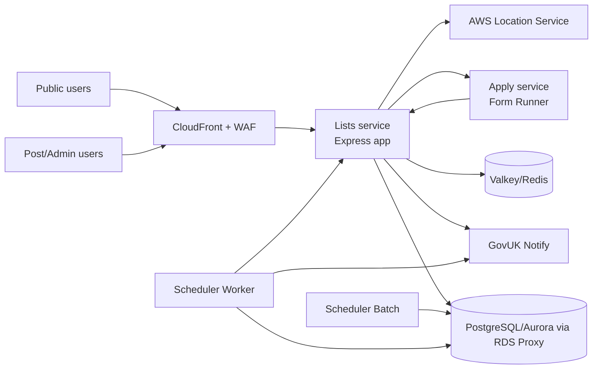
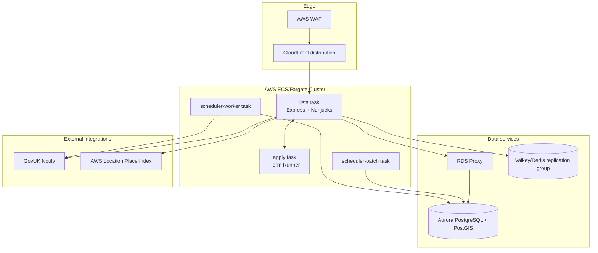
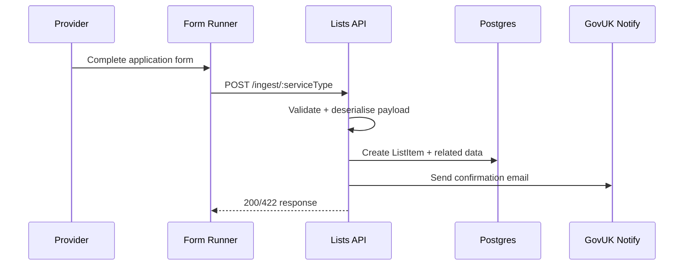
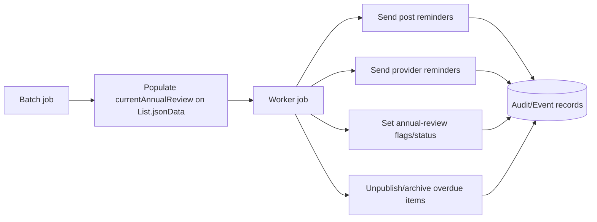

# High-Level Design: FCDO Lists

## Purpose

This document gives a public-safe, high-level design of the Lists platform by combining:

- application behavior from the `lists` repository
- infrastructure topology patterns from the `lists-infra` repository

It intentionally avoids private operational detail (for example account IDs, sensitive endpoints, credentials, and internal runbooks).

## Scope and boundaries

### In scope

- user journeys: **Find**, **Apply**, **Dashboard/Admin**, **Annual review**
- core runtime services and integrations
- data model and key state transitions
- scheduled processing model
- high-level AWS deployment topology

### Out of scope

- environment-specific secrets and credentials
- private incident procedures and contact details
- low-level Terraform module internals

## Repository split

- `lists` (public): Node.js/TypeScript application, scheduler logic, views, tests
- `lists-infra` (private): Terraform for AWS networking, compute, data, edge, security, and operations

This split supports public application development while keeping infrastructure/security implementation private.

## System context

## Container view

## Application architecture (`lists`)

### Runtime composition

- Express server bootstraps middleware, auth/session, routes, and error handlers
- Server-side rendered UI via Nunjucks + GOV.UK Frontend
- `/application/*` routes are proxied to Form Runner and response links are rewritten to remain under Lists paths
- API endpoints for ingestion are mounted before CSRF middleware so Form Runner webhooks can post safely

### Primary route groups

- Public find journey: `/find/*`
- Public apply journey (proxied): `/application/*`
- Ingestion webhooks: `/ingest/:serviceType` and `/ingest/:serviceType/:id`
- Admin/dashboard: `/dashboard/*`
- Auth/login: `/login`, JWT link auth, session-backed access
- Annual review provider flow: `/annual-review/*`
- Health endpoints: `/health-check`, `/ping`

### Service types

Current service types are:

- lawyers
- funeral directors
- translators/interpreters

The codebase is designed to extend this set with additional deserialisers, routes, and search filters.

## Data architecture

Core persisted entities (Prisma/PostgreSQL):

- `List` - service type + country + annual review metadata
- `ListItem` - provider submission and publication state
- `Address`, `Country` - normalized location data
- `User` - dashboard/admin users and list ownership
- `Event` - list item event stream
- `Audit` - cross-entity audit trail
- `Feedback` - user feedback records

Key design characteristics:

- mixed relational + JSONB model for flexible provider schemas
- PostGIS for geospatial operations (via raw SQL where needed)
- explicit status and event history transitions for list items

## Core flows

### 1) Provider apply and ingest

### 2) Find journey

- user selects service type and country
- route handlers persist answers in session
- search queries provider data by type/country/filters
- results are server-rendered and include related links where available

### 3) Dashboard moderation flow

- authenticated post/admin users access list and item management
- edits, publish/unpublish, annual-review actions update `ListItem.status` and append `Event`/`Audit` records
- notification emails are triggered for key moderation events

## Scheduler model

Two scheduled jobs run daily (times are configured in infrastructure schedules):

- **Batch**: prepares annual review state and key dates for eligible lists/items
- **Worker**: evaluates milestones, sends reminders, transitions item states, handles unpublish path

## Infrastructure overview (`lists-infra`)

At a high level, private Terraform provisions:

- CloudFront distribution with WAF and TLS termination
- ALBs (public-facing Lists, internal Apply)
- ECS/Fargate services for Lists and Apply
- ECS task definitions for scheduler batch/worker (triggered by EventBridge Scheduler)
- Aurora PostgreSQL cluster + RDS Proxy
- Valkey/Redis replication group
- CloudWatch logs/alarms and deployment pipeline resources
- optional Cognito-at-edge behavior in non-production patterns

## Security and privacy considerations

- this document is intentionally abstracted to remain safe for a public repo
- no private account, secret, or incident-response details are repeated here
- infra internals should continue to live in the private `lists-infra` repository

## Operational notes (high-level)

- lists runtime depends on Postgres, Redis, GovUK Notify, and AWS Location
- scheduler behavior depends on list/item event history and annual-review metadata quality
- authentication and role checks gate dashboard/admin capabilities

## Assumptions and known gaps

- exact production/non-production policy differences are maintained privately in `lists-infra`
- this HLD focuses on architecture and flows, not SLOs/capacity numbers
- analytics exports exist in scheduler code but are not expanded here

